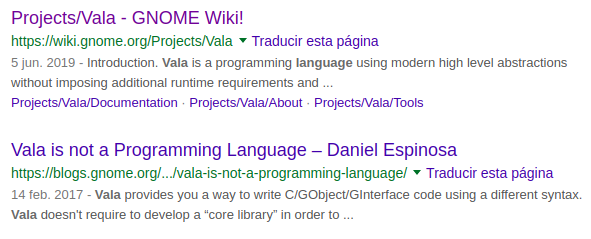

# My Vala Repository to Learn and Test
- brunodiazu


#  :paperclip: Description
I'll use this repository to create new pre-template apps, learn of Vala, share my code with myself and other person (Who knows?)


# :rainbow: Installation

## SDK
I'm using ElementaryOS, so I installed the SDK to create new apps,

$ ``` sudo apt-get install elementary-sdk```

$ ``` gtk3-widget-factory ``` (if you don't installed  GTK+)

## IDE

I tried to install GNOME Builder but I couldn't and don't know with, but I'll use Visual Studio Code. Elementary also has Code App.

## UX/UI 

We can use [Akira](https://github.com/akiraux/Akira) to create prototypes or other stuff.

## GTK+
Nice application :smile:

$ ```gtk3-widget-factory```

# :scroll: References and Documentation

## About Vala
Vala is(n't) a programming lenguaje using high level abstractions. It's simple and beautiful



<!--[NameOfLink](https://www.TheLink.here)-->
- [Vala](https://wiki.gnome.org/Projects/Vala)
- [ValaDoc](https://valadoc.org/)
- [Gtk](https://www.gtk.org/)